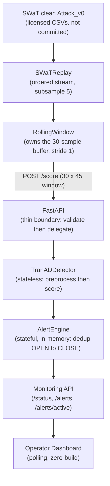

# Water Chlorination ICS Security

**Platform for Protecting Water Chlorination Systems from Cyber Attacks** — an end-to-end, local OT/ICS security monitoring MVP that productionizes a TranAD process-aware anomaly detector for the SWaT water-treatment dataset.

> **Status:** Graduation project. Local MVP working end-to-end, containerized (**Phase 8B — complete**): Docker/`docker compose` deployment with three interchangeable alert-persistence backends (in-memory / SQLite / PostgreSQL). Cloud, CI/CD security gates, and multi-instance coordination are **planned**, not yet implemented. See [MVP Status](#8-mvp-status) and [Roadmap](#14-project-roadmap).

---

## 1. Overview

Industrial control systems (ICS) that run water treatment — pumps, valves, dosing, and the sensors around them — were designed for reliability, not for adversaries on the network. A cyber attack that manipulates a chlorination process can be safety-critical, yet it often looks like valid control traffic to conventional IT security tooling.

This project takes a **process-aware** approach: instead of inspecting packets, it models the *physical behaviour* of the plant from its telemetry and flags states the model cannot explain. It uses **TranAD**, a transformer-based reconstruction anomaly detector, trained and evaluated on the **SWaT** (Secure Water Treatment) testbed dataset, and wraps it in a working monitoring system.

What the system currently does, end-to-end and locally:

1. Replays real SWaT telemetry as an ordered stream.
2. Maintains a rolling 30-sample window of 45 process variables.
3. Scores each window with TranAD over a thin FastAPI boundary.
4. Turns detections into deduplicated, lifecycle-managed alerts.
5. Exposes monitoring endpoints and a minimal operator dashboard.

This is a **research / graduation project** built on testbed data — not a production water-treatment control system. See [Security / Responsible Use](#16-security--responsible-use).

---

## 2. Key Features

Currently implemented and tested:

- **SWaT telemetry replay** — feeds the reconstructed clean `Attack_v0` series as an ordered stream (`simulator/swat_replay.py`).
- **Rolling 30-sample window** — stride-1 buffering owned entirely by the caller (`simulator/window_buffer.py`).
- **TranAD anomaly detection** — the selected MVP model, loaded from fixed artifacts; stateless scoring (`ml/src/`).
- **Per-feature attribution** — each score carries a 45-length per-feature reconstruction error (top contributing sensors).
- **Thin, stateless FastAPI backend** — validate → delegate → shape; no per-request/streaming state (`backend/`).
- **Alert engine** — deduplication and `OPEN → CLOSED` lifecycle; a continuous anomaly is one alert (`alerting/`).
- **Monitoring API** — read-only `/status`, `/alerts`, `/alerts/active` over the in-memory alert state.
- **Operator dashboard** — zero-build, vanilla HTML/JS, polls the API only (`frontend/index.html`).
- **End-to-end demo** — normal / attack / recovery flow over a real HTTP boundary (`scripts/run_e2e_demo.py`).
- **Alert persistence** — three interchangeable backends behind one `AlertStore` interface: in-memory (default), durable `SQLiteAlertStore`, and networked `PostgreSQLAlertStore` (Phase 8B); active incidents + history survive a restart on both durable backends (`alerting/store.py`).
- **Docker deployment (Phase 8A)** — reproducible CPU-only, non-root, read-only backend image + static dashboard image, `docker compose up` local stack, SQLite persisted to a named volume (`docker/`, `docker-compose.yml`).
- **PostgreSQL mode (Phase 8B)** — `docker-compose.postgres.yml` overlay adds a PostgreSQL service (persistent volume, healthcheck, env-only credentials); the backend selects it with `ALERT_STORAGE_BACKEND=postgres`.
- **411 automated tests** passing (`pytest`), including a real-PostgreSQL integration suite.

> AWS, Terraform, Kubernetes, CI/CD, DevSecOps security gates, authentication, TLS to the database, and distributed multi-instance coordination are **not implemented** in the current repository. They are tracked in the [roadmap](#14-project-roadmap).

---

## 3. Architecture

The current system is a layered pipeline with deliberately clean boundaries. The **client owns the rolling buffer**, the **detector is stateless**, the **FastAPI layer is a thin boundary**, and the **alert engine is the one intentionally stateful stage** — its lifecycle state is made durable behind a swappable `AlertStore` (in-memory / SQLite / PostgreSQL).



| Component | Directory | Responsibility | State |
|---|---|---|---|
| SWaTReplay | `simulator/swat_replay.py` | Loads and streams the clean `Attack_v0` reconstruction | none |
| RollingWindow | `simulator/window_buffer.py` | Owns the 30-sample stride-1 buffer; emits full windows | buffer only |
| FastAPI backend | `backend/app.py` | Thin API: validate shape/features, delegate to detector, shape response | none (per-request) |
| TranADDetector | `ml/src/detector.py` | Preprocessing + TranAD scoring + threshold decision | **stateless** |
| AlertEngine | `alerting/engine.py` | Dedup + `OPEN → CLOSED` lifecycle + heuristic severity | **in-memory** |
| Monitoring API | `backend/app.py` | Read-only rollup of detector + latest detection + alerts | reads engine |
| Dashboard | `frontend/index.html` | Operator view; consumes the API only | none |

**Dependency direction** is strictly `backend → ml.src`. The `simulator/` package imports neither `torch`, `fastapi`, nor `ml.src`; the `alerting/` package imports none of `torch`, `fastapi`, `ml.src`, or `simulator` (it duck-types on the detector's result). This keeps every layer independently testable.

> **Implementation-order note:** the replay + rolling-window layer (Phase 2A) was built *before* the FastAPI backend (Phase 2B) specifically so the backend could stay a thin, stateless API with the 30-sample buffer owned by the caller. This differs from the numbered sketch in `PROJECT_CONTEXT.md`.

---

## 4. ML Model — TranAD

**TranAD is the actual MVP detection model.** Multiple anomaly-detection models were trained and compared during the research phase; TranAD was selected. **Model selection is complete** — TranAD is not being replaced, retrained, or recalibrated for the MVP. The five artifacts under `ml/artifacts/swat_TranAD/` are treated as immutable and byte-identical:

```text
ml/artifacts/swat_TranAD/
├── feature_names.json     # 45 names, ordered — defines the model contract
├── scaler.joblib          # StandardScaler
├── minmax_scaler.joblib   # MinMaxScaler (1350 columns, clip=False)
├── model.pt               # TranAD weights (state_dict)
└── threshold.json         # fixed threshold @ 99th percentile
```

### Model contract

| Property | Value |
|---|---|
| Features | 45 process variables |
| Window | 30 timesteps |
| Stride | 1 |
| Subsample | 5 (keep every 5th row of the 1 Hz source) |
| Effective sample interval | 5 seconds/sample |
| Window span (context) | 150 seconds (30 × 5 s) |

### Preprocessing chain (must match the research pipeline exactly)

The order is load-bearing — each step feeds the next (`ml/src/preprocessing.py`):

1. Select + order the 45 columns per `feature_names.json`.
2. **StandardScaler** — per-feature, on raw rows, in float64.
3. **Cast to float32** — *before* the MinMax step (matches the research `make_windows`).
4. **C-order flatten** to 1350 columns (`index = t * 45 + f`, timestep-major).
5. **MinMaxScaler** with **`clip=False`** — attack windows scale outside `[0, 1]`, and that excursion *is* the detection signal.
6. Reshape back to `30 × 45` float32 → TranAD input.

Non-finite input is **rejected, not imputed**: a stuck or absent channel is an operational fault the caller must handle (the research code's blanket forward-fill is a known cause of the calibration caveat below).

### Scoring & attribution

TranAD reconstructs only the **last timestep** of each window; the score is `0.5·MSE(x1, elem) + 0.5·MSE(x2, elem)` averaged over the 45 features. Because the error is taken *before* the feature-dim mean, the detector also exposes a **per-feature reconstruction error vector** — the top contributing features, i.e. which sensors drove the score. This is the direct evidence for the "process-aware detection" claim, and it is surfaced through the API and dashboard.

---

## 5. Dataset

The project uses the **SWaT (Secure Water Treatment)** dataset from iTrust — a real, labelled water-treatment testbed, the closest public analog to the chlorination use case.

- The dataset is **local / licensed and is NOT committed to this repository.** It is not redistributed here.
- The repository expects the CSVs via an environment variable: **`SWAT_DATASET_DIR`** (default fallback path `~/Downloads/SWaT/SWaT-dataset/`).
- The project scores the reconstructed clean **`Attack_v0`** replay source; the research `merged.csv`-style concatenation is **excluded** from the replay pipeline because of a documented data defect (duplicated normal block, frozen features). See `docs/provenance/`.

**Effective sampling / window relationship:**

```text
5 seconds  per sample   (1 Hz source, subsample = 5)
30 samples per window
150 seconds of temporal context per window
```

150 seconds is therefore both the buffer fill time and the floor on detection latency.

---

## 6. Detection & Alerting

**Detection** (`ml/src/`, `backend/app.py`):

- Each `30 × 45` window yields an **anomaly score** (TranAD reconstruction error) and a per-feature error vector.
- **Threshold decision** is `anomaly_score > threshold` (strictly greater, matching the research code) — **point-wise**, one decision per window.

**Alerting** (`alerting/`):

- On the first anomalous window an alert is **created** (`OPEN`).
- Overlapping anomalous windows are **deduplicated** into that same alert — a continuous anomaly is **one** incident, not one alert per window.
- On return to normal the alert **closes** (`OPEN → CLOSED`) and moves to history.
- Attribution (top contributing features) is **reused verbatim** from the detector, never recomputed.

> **Severity is an engineering heuristic** based on the `score / threshold` ratio. It is **NOT an ML model output** — the model emits one score and one threshold, with no validated multi-level severity mapping.

> **Alert state is currently in-memory only and is lost when the backend process restarts.** There is no database in this phase.

---

## 7. Current Evaluation Results

Metrics are re-runnable via `scripts/measure_detection_metrics.py`, not hand-transcribed. Full derivation: [`docs/provenance/measured_detection_metrics.md`](docs/provenance/measured_detection_metrics.md).

**Primary deployment-oriented metrics** — point-wise, clean `Attack_v0`, last-timestep labels, at the shipped threshold:

| Metric | Value |
|---|---:|
| Precision | 0.7822 |
| Recall | 0.7821 |
| **F1 (point-wise)** | **0.7822** |
| False-positive rate | 3.0117% |
| ROC-AUC | 0.9429 |
| PR-AUC | 0.8516 |

**Point-wise metrics are the primary deployment figures.** Point-adjusted metrics (e.g. the research `F1_fixed ≈ 0.7934`) are reported only with their protocol stated, because point adjustment systematically overstates performance.

> The historical headline **`F1 ≈ 0.9999` must NOT be presented as deployment performance.** It came from a threshold searched on the test set; the research notebook itself warns that column "can read ~1.0 even for a broken model."

**Threshold:** `9.269035945180804e-05` (the 99th percentile of TranAD scores on the normal-validation split). It is shipped **unmodified**. Because 6 of the 45 features were frozen constants on the calibration split, the real FPR exceeds the nominal 1% — this is surfaced, not silently corrected. **Threshold recalibration is currently deferred** (a separate, approval-gated experiment); it has **not** happened.

---

## 8. MVP Status

**Current phase: Phase 5A — COMPLETE.** The local MVP works end-to-end.

| Phase | Scope | Status |
|---|---|---|
| Phase 0 | Foundation / provenance (verified artifact contract, pinned environment) | ✅ Complete |
| Phase 1 | TranAD production inference library (`ml/src`) + golden-vector tests | ✅ Complete |
| Phase 1.5 | Threshold-honesty evaluation + measured detection metrics | ✅ Complete |
| Phase 2A | SWaT replay + rolling window (`simulator/`) | ✅ Complete |
| Phase 2B | FastAPI backend (`backend/`) — thin API over the stateless detector | ✅ Complete |
| Phase 3 | End-to-end integration: replay → window → HTTP `/score` → TranAD | ✅ Complete |
| Phase 4 | Alert engine: detections → deduplicated, lifecycle-managed alerts (`alerting/`) | ✅ Complete |
| Phase 5A | Monitoring API + minimal operator dashboard (`frontend/`) | ✅ Complete |

Verified in the repository (as documented in `PROJECT_CONTEXT.md` and the project briefing):

- **286 tests passing** (`pytest`), including backend API, monitoring API, Phase 3 end-to-end integration, and Phase 4 alert-engine cases.
- **Real HTTP verification** — the demo runs over both the in-process ASGI app and a real `uvicorn` socket.
- **Normal, attack, and recovery scenarios** exercised end-to-end.
- **Dashboard monitoring** and full **alert lifecycle** (`OPEN → CLOSED`) demonstrated.

---

## 9. Manual Local Setup

Assumes Linux + Python 3.10.

### Clone

```bash
git clone <your-repo-url> water-chlorination-ics-security
cd water-chlorination-ics-security
```

### Environment

```bash
python3 -m venv .venv
source .venv/bin/activate
```

Install the ML runtime (CPU-only torch) and the backend:

```bash
# ML inference library (pins: scikit-learn 1.7.2, numpy 2.2.6, torch 2.9.1)
.venv/bin/pip install \
  --index-url https://download.pytorch.org/whl/cpu \
  --extra-index-url https://pypi.org/simple \
  -r ml/requirements.txt

# Backend (FastAPI + uvicorn)
.venv/bin/pip install -r backend/requirements.txt

# Test toolchain (optional, to run the suite)
.venv/bin/pip install -r ml/requirements-dev.txt
```

> The pinned versions are deliberate — the scaler artifacts embed `scikit-learn==1.7.2` and reference `numpy._core` (requires numpy ≥ 2), and the golden vectors were generated under `torch==2.9.1`. See `ml/requirements.txt` for the full rationale.

### Dataset

Point the tools at your **local, licensed** SWaT CSVs — **do not** place them inside the repository:

```bash
export SWAT_DATASET_DIR="$HOME/Downloads/SWaT/SWaT-dataset"
```

### Backend

```bash
uvicorn backend.app:app                 # http://127.0.0.1:8000
# add --reload for development
```

The detector loads lazily on the first request, so import/startup stays cheap.

### Frontend

Serve the static dashboard separately (the dev model):

```bash
cd frontend && python -m http.server 5500     # open http://127.0.0.1:5500/
```

The backend allow-lists the dev static-server origins via explicit CORS (not a wildcard). Configure the dashboard via query params, e.g. `http://127.0.0.1:5500/?api=http://127.0.0.1:8000&poll=1000`.

### Verify

```bash
curl -s http://127.0.0.1:8000/health     # 200 + detector diagnostics
curl -s http://127.0.0.1:8000/status     # system + detector + alert rollup
```

Interactive API docs (Swagger UI): open **http://127.0.0.1:8000/docs**.

### Docker (reproducible local deployment — Phase 8A)

Run the whole stack in containers instead of the manual setup above:

```bash
docker compose up --build -d      # backend :8000 + dashboard :8080
# open http://127.0.0.1:8080      (dashboard defaults to the API on :8000)
docker compose ps                 # both services should be "healthy"
docker compose down               # stop (keeps persisted alerts)
# docker compose down -v          # stop AND wipe the alert-data volume
```

The backend image is CPU-only, non-root (uid 10001), runs on a read-only root
filesystem, and persists alerts to SQLite in the named `alert-data` volume
(`ALERT_STORAGE_BACKEND=sqlite`, `ALERT_DB_PATH=/data/alerts.sqlite3`), so alerts
survive a container restart. The **SWaT dataset is not baked into the image** —
the API starts from the immutable `ml/artifacts/` alone; replay/evaluation stays
a separate local path. Full design, hardening, and smoke-test evidence:
`docs/provenance/phase8a_docker.md`.

### PostgreSQL backend (Phase 8B)

To run with a networked PostgreSQL database instead of SQLite, add the overlay and
supply credentials via `.env` (the base file stays SQLite-only, so the default flow
above is unchanged):

```bash
cp .env.example .env              # then set a strong POSTGRES_PASSWORD
docker compose -f docker-compose.yml -f docker-compose.postgres.yml up --build -d
# ... same API :8000 + dashboard :8080 ...
docker compose -f docker-compose.yml -f docker-compose.postgres.yml down      # keep data
docker compose -f docker-compose.yml -f docker-compose.postgres.yml down -v   # wipe data
```

The overlay adds a `postgres` service with a persistent named volume, a
`pg_isready` healthcheck (the backend waits for it), and internal-only networking
(Postgres is **not** published to the host). Credentials come from `.env`
(git-ignored) — never source. The same `PostgreSQLAlertStore` recovers active
incidents + history across a backend restart, and the data survives a Postgres
container restart via its volume. It is the same `AlertStore` interface and
`AlertEngine` semantics as SQLite — only the storage backend differs. Details:
`docs/provenance/phase8b_postgres_alertstore.md`.

---

## 10. Running the End-to-End Demo

The demo reuses the production components unchanged (`scripts/run_e2e_demo.py`). It needs `SWAT_DATASET_DIR` set. `--real-time-factor inf` means "no wait" for a fast run. By default it drives the in-process ASGI app; pass `--base-url` to hit a running server over real HTTP.

**Normal** (a clean segment → stays normal):

```bash
python scripts/run_e2e_demo.py \
  --mode normal \
  --base-url http://127.0.0.1:8000 \
  --real-time-factor inf
```

**Attack** (an attack segment → anomaly flagged):

```bash
python scripts/run_e2e_demo.py \
  --mode attack \
  --attack-segment 7 \
  --base-url http://127.0.0.1:8000 \
  --real-time-factor inf
```

**Recovery** (re-run the normal replay after the attack; the active alert returns to normal and closes):

```bash
python scripts/run_e2e_demo.py \
  --mode normal \
  --base-url http://127.0.0.1:8000 \
  --real-time-factor inf
```

> **Why pass an explicit `--attack-segment` for the manual demo.** In attack mode without it, the script *auto-selects* the clearest segment by probing each segment's first few windows through the same live `/score` endpoint. Against a running server, those probe calls feed the **in-memory alert engine** and can perturb the alert/monitoring state you are trying to demonstrate. Pinning a segment (e.g. `7`) makes the demo deterministic and avoids that probing side-effect.

---

## 11. API

Base URL (dev): `http://127.0.0.1:8000`. Implemented endpoints:

| Method | Path | Purpose |
|---|---|---|
| GET | `/health` | Liveness + detector readiness (**503** if the detector cannot load) |
| POST | `/score` | Score one complete `30 × 45` telemetry window |
| GET | `/status` | System + detector + latest-detection + alert rollup (always **200**; `degraded` if detector down) |
| GET | `/alerts` | Alert history, most-recent first (`?limit=`, `?status=open\|closed`) |
| GET | `/alerts/active` | The currently-open alert, or `null` when normal |
| GET | `/docs` | Swagger UI |

`POST /score` expects a **complete `30 × 45` window** — the caller owns the rolling buffer; no streaming state is kept between requests. The body carries a `feature_names` list (must equal the model's canonical order exactly) plus a `window` of exactly 30 rows, each with one finite value per feature. Shape/finiteness/duplicate violations return **422**; wrong feature identity or order returns **422** with a distinct message.

Response shape (see `backend/schemas.py`): `anomaly_score`, `threshold`, `is_anomaly`, `feature_errors` (per-feature contribution in canonical order), `feature_names`, and echoed `window_start` / `window_end`.

---

## 12. Repository Structure

```text
.
├── ml/               # TranAD production inference library + immutable artifacts + config
│   ├── src/          # preprocessing, model, scoring, detector, dataset, metrics
│   └── artifacts/    # swat_TranAD/ — the 5 immutable model artifacts
├── simulator/        # SWaT replay + rolling 30-sample window + e2e pipeline
├── backend/          # thin, stateless FastAPI app + Pydantic schemas
├── alerting/         # in-memory alert engine (dedup + OPEN→CLOSE lifecycle)
├── frontend/         # zero-build operator dashboard (index.html)
├── scripts/          # run_e2e_demo.py, measure_detection_metrics.py
├── tests/            # 286 tests (unit, ML inference, API, integration, golden vectors)
├── research/         # research notebooks (history; not production, do not import)
├── docs/             # provenance, architecture, proposal, project briefing
├── infrastructure/   # PLANNED: terraform/ + kubernetes/ scaffolding (empty)
└── docker/           # PLANNED: containerization (empty)
```

Each of `ml/`, `simulator/`, `backend/`, `alerting/`, `frontend/` carries its own `README.md`. `docs/provenance/` is the source of truth for the model contract and metrics. `docker/` holds the backend/frontend Dockerfiles and runtime manifest (Phase 8A); `infrastructure/` is a placeholder for planned cloud work and contains no implementation yet.

---

## 13. Testing

```bash
.venv/bin/python -m pytest        # or: pytest
```

**Current verified count: 411 tests passing.** The suite covers preprocessing, the TranAD model and scoring, the detector, golden-vector parity, the SWaT replay and rolling window, the backend API, the monitoring API, the alert engine, telemetry-health / telemetry-fault handling, alert persistence across all three backends (in-memory, SQLite, and a **real-PostgreSQL** integration suite that spins up a throwaway `postgres:16-alpine` container — skipped only if Docker is unavailable), the Phase 3 end-to-end integration, and static Docker-packaging validation. Tests that require the licensed dataset are guarded; the golden-vector fixtures are committed so ML inference parity is testable without the raw CSVs.

---

## 14. Project Roadmap

### Currently implemented

TranAD inference library, SWaT replay + rolling window, thin FastAPI backend, end-to-end integration, alert engine with telemetry-fault track, alert persistence across three interchangeable backends (in-memory / SQLite / PostgreSQL), monitoring API, operator dashboard, Docker containerization (backend + dashboard, `docker compose`, SQLite and PostgreSQL modes), 411 tests — see [Key Features](#2-key-features) and [MVP Status](#8-mvp-status).

### Future work (planned / not yet implemented)

| Item | Notes |
|---|---|
| Distributed multi-instance coordination | Cluster-safe `AlertEngine` (e.g. `SELECT … FOR UPDATE` / leader); PostgreSQL storage is present (Phase 8B) but engine coordination is not |
| CI/CD | Automated build/test pipeline |
| SAST | Static application security testing gate |
| Dependency scanning | Supply-chain vulnerability scanning |
| Container scanning | Image vulnerability scanning |
| AWS | Cloud deployment |
| Terraform | Infrastructure-as-code |
| **Kubernetes** | **Stretch / future** per current project decision |
| Authentication | API/dashboard auth |
| Notifications | Alert delivery (email/webhook/etc.) |
| Observability | Metrics/logging/tracing |
| Performance testing | Final load/latency validation |
| Final documentation / demo | Runbook, architecture docs, presentation |

> **Threshold recalibration is a separate, deferred experiment** — approval-gated and, if run, only as a sibling artifact. It is **not** part of the currently shipped MVP.

---

## 15. Known Limitations

These are current, documented characteristics — not bugs unless noted:

- **~150-second context fill.** The model needs a full 30-sample window (≈150 s) before it can score; that is also the detection-latency floor.
- **~3% false-positive rate** under the current point-wise evaluation, driven by the documented threshold-calibration caveat (6 of 45 features frozen on the calibration split). Surfaced honestly; not silently corrected.
- **Persistence: in-memory / SQLite / PostgreSQL.** Alerts survive a restart via `SQLiteAlertStore` (single-writer, local file/volume) or `PostgreSQLAlertStore` (networked server, Phase 8B); the in-memory store remains the default for un-configured callers. PostgreSQL makes storage server-grade, but **distributed multi-instance `AlertEngine` coordination is not implemented** — a single engine process is assumed. No TLS to the database / no cloud secret manager yet (credentials via env/`.env`).
- **No authentication** on the API or dashboard yet.
- **Local containers only.** Docker/`docker compose` deployment exists (Phase 8A, SQLite and PostgreSQL modes); no cloud deployment yet (no AWS/Terraform/Kubernetes).
- **No CI/CD security gates** yet.
- **Demo auto-selection caveat.** In attack mode without `--attack-segment`, the auto-selection probing scores windows through the live endpoint and can perturb in-memory alert state — pass an explicit segment for a clean manual demo (see [§10](#10-running-the-end-to-end-demo)).

---

## 16. Security / Responsible Use

This is a **research / graduation project** that uses the iTrust **SWaT testbed** dataset. It is **not** a production-ready water-treatment control system and must not be deployed as one. The dataset is licensed and is **not redistributed** here — obtain it from iTrust and provide it locally via `SWAT_DATASET_DIR`.

The project is defensive: it detects and reports anomalous process behaviour. It does not contain, and this document does not provide, operational instructions for attacking water-treatment infrastructure.

---

## 17. Team / Project Information

- **Domain:** OT / ICS Security
- **Type:** Graduation project
- **Team roles** (as documented in `docs/PROJECT_BRIEFING_AND_ROADMAP.md`, §11): ML/detection, Backend/API, Alerting/persistence, Frontend/dashboard, Infrastructure/cloud, DevSecOps/CI-CD, and Testing/documentation. Individual member and supervisor names are not recorded in the repository, so none are asserted here.
- Additional context: `PROJECT_CONTEXT.md`, `docs/PROJECT_BRIEFING_AND_ROADMAP.md`, `docs/proposal/`, and `docs/provenance/`.

---

## 18. License

This repository does **not** currently contain a license file, so it is **unlicensed**. No license is asserted or added here. Note that the SWaT dataset is separately licensed by iTrust and is not part of this repository.
